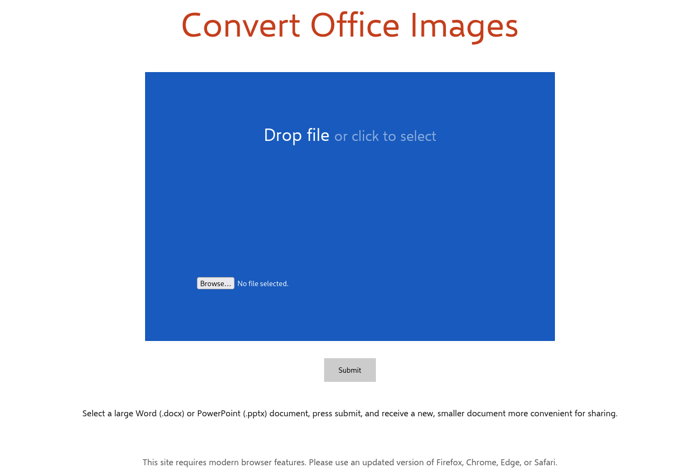

# Convert Office Images

A simple web app to convert all images in a Word (.docx) or PowerPoint (.pptx)
document to JPEGs, to reduce file size of large documents with uncompressed
images. Everything is done fully in the browser using WebAssembly,
no data is sent elsewhere.

## Building

The frontend of the application is in the `web` directory. Building this with
`npm install && npm build` (or using your package manager of choice) will
compile the WebAssembly module in `wasm_wrapper` using
Rust's build system `cargo`, which must be installed separately.

The main Rust source (in `src`) also contains a binary to perform the same file
operations as the web application. It accepts input via stdin, and writes
output to stdout.

You can run it from this directory using
`cargo run -- < input-file.docx > output-file.docx`.

## TODO

-   [ ] Offline PWA support
